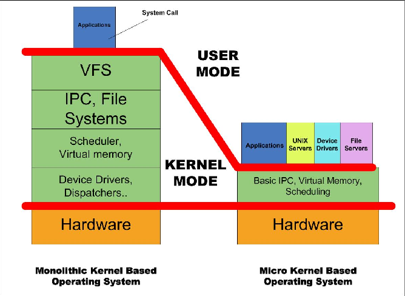

# IPC ( Inter-Process Communication )

執行程序間通訊（ IPC，Inter-Process Communication ），指作業系統提供給至少兩個執行程序 ( Porcess ) 間傳送資料或訊號技術方式；在微服務與分散式系統內啟動的複數執行程序，便需要以此通訊方式來協調服務間的運作；倘若產品、專案橫向擴展服務時，亦可利用執行程序間通序來串聯運作，以此方式逐步增加服務的運用。

在單核 ( Monolithic kernel ) 與微核 ( Microkernel ) 的架構中，將單核的垂直結構改為橫向結構，其主要方式便是將驅動、服務轉為執行程序，透過執行程序間通訊來擴展，讓必要的服務互相運作，避免冗餘的服務占用系統資源。


> Reference : [Inter-Process Communication Mechanism in Monolithic Kernel and Microkernel](http://cdworkshop.eit.lth.se/fileadmin/eit/project/142/IPC_Report.pdf)

專案範例環境如下：

+ Operating System : Debian ( Docker Container )
+ Language : C++ / C#

## 通訊方式

依據作業系統的規範，每個軟體 ( Software ) 被執行後，會在作業系統視為一個執行程序 ( Process )，而每個執行程序擁有至少一個執行序 ( Thread )，以及屬於執行程序可管理的記憶體區塊 ( Memory )；因此，在執行程序中的執行序，可以透過記憶體區塊來共享資訊，甚至用於執行緒間通訊，然而這樣的通訊會因為執行緒的處理速度不同步，導致[併發衝突 ( Concurrency )](https://medium.com/mr-efacani-teatime/1b212a020e30)，對此，在執行緒共享記憶體時會要求遵循[執行緒安全 ( Thread Safe )](https://zh.wikipedia.org/zh-tw/%E7%BA%BF%E7%A8%8B%E5%AE%89%E5%85%A8) 法則，進而避免併發導致的[飢餓 ( Starvation )](https://en.wikipedia.org/wiki/Starvation_(computer_science)) 與[死結 ( Dadlock )](https://en.wikipedia.org/wiki/Deadlock) 狀態。

然而，在執行緒間存在的資源共享，在執行程序間並不被允許，考量各執行程序本是不同方式與來源的開發團隊，在安全性考量下，避免直接的記憶體共享亦是避免來源不明的資訊會入導致異常；但若執行程序屬於同個開發團隊設計，且基於服務性質而存在資訊共享的必要，則會使用執行程序間通訊（ Inter-Process Communication ) 並依循其通訊格式來傳遞資訊。

依據參考文獻，目前執行程序間通訊（IPC，Inter-Process Communication）常見方式如下：

+ [Shared files](#shared-files)
+ [Shared memory](#shared-memory)
+ [Semaphores](#semaphores)
+ [Pipes (named and anonymous)](#pipes)
+ [Message queue](#message-queue)
+ [Socket](#socket)
+ [Signals](#signals)

並有兩個常見的執行程序啟動，方式如下：

+ 至少兩個執行於不同終端機 ( Terminal ) 下的執行程序
+ 由一個執行程序 ( Parent ) 通過系統函數 [fork](https://man7.org/linux/man-pages/man2/fork.2.html) 生成另一個執行程 ( Child )

其共通的通訊程序如下：

+ 執行程序中存在一個執行緒負責執行通訊函式
+ 通訊函式依據通訊格式存取內容
+ 若格式的內容未變更，無需觸發後續處理函數

### [Shared files](./src/shared-files)

共享檔案 ( Shared files ) 是個可運用於任何作業系統的簡易方式，其概念是透過檔案來傳遞資訊；然而這樣的方式很容易受到 I/O 影響執行效率且對檔案的快速寫入、讀取，會讓權管理異常使得資源無法獲得而進入飢餓 ( Starvation );
但若運用於低傳訊頻率的執行程序間，是個簡易且技術相依低的運用方案。

### [Shared memory](./src/shared-memory)

共享記憶體 ( Shared memory ) 可視為共享檔案的進階方式，為解決前面提到對檔案存取產生的問題，則是將資料讀寫進記憶體，並令執行程序共享一個用於通訊的記憶體區域；雖然記憶體存取改善了效率與權限異常的風險，但共享記憶體並非無限的空間，因此在設計上僅限用於訊息的傳遞，倘若有大量的資料共享，則需回歸到共享檔案的方式來解決。

### Semaphores

基於共享記憶體 ( Shared memory ) 的旗號 ( Semaphores ) 機制，其目的是考量共享記憶體在多執行程序運用時，假設多個執行程序同時有讀寫共享記憶體的需要，則透過旗號機制，來避免並行性 ( Concurrency ) 異常發生；依據實踐方式共有兩種旗號類型：

+ Binary Semaphores：使用 0、1 來做 lock、unlock 控制，以此達到互斥 ( Mutex ) 效果
+ Counting Semaphores：使用計數器來做資源控制，若資源被使用則增加計數，使用完畢則減少計數

### Pipes

詳閱文獻後，一般在執行程序間通訊的文獻中提到管線，就是指匿名管線，命名管線則是指使用先入先處 ( FIFO ) 方式的管線。

#### [Anonymous pipes](./src/pipes/anonymous)

匿名管線 ( Anonymous pipes ) 或稱為管線 ( Pipes )，是基於 Unix 系統指令 [pipe](https://man7.org/linux/man-pages/man2/pipe.2.html) 的執行程序間通訊，這方式是透過管線在記憶體建立一個 "Virtual File"，並提供一個讀取 ( 0 )、寫入 ( 1 ) 的串流編號陣列，由於為串流資訊，因此可以透過 write、read 指令對其寫入內容。

就其運作原理，管線與共享記憶體的運作方式相似，差別是對於記憶體宣告與讀寫管理是由管線系統管理，並提供指定串流讓訊息進出，程式上對內容相對容易管理；其缺點是管線僅適用於前述第二種執行程序啟動方式，亦即執行程序透過 fork 產生的自身的多執行程序運作方式。

#### [Named pipes](./src/pipes/named)

命名管線  ( Named pipes ) 或稱為先入先出 ( FIFO、First-In-First-Out )，是基於 Unix 系統指令 [mknod](https://man7.org/linux/man-pages/man2/mknod.2.html) 的執行程序間通訊，這方式是透過 mknod 的 ```S_IFIFO``` 參數建立 FIFO 特殊檔案，在透過檔案讀寫機制來存取檔案內容。

就其運作原理，命名管線與共享檔案的運作方式相似，差別是 FIFO 檔案具有柱列效果，而若共享檔案則需自行設計讀寫機制來自行設計管線的效果；其缺點是 FIFO 是讀取後內容會清除，並不適合雙向溝通或對多執行程序的廣播，倘若要雙向則需建立各自的檔案或設計延遲機制等待回應，而若廣播則需改用共享檔案的原理來設計。

### [Message Queue](./src/message-queue)

訊息柱列 ( Message queue ) 可視為共享記憶體的進階方式，藉由柱列管理的方案，提取記憶體中的格式化內容；相比共享記憶體的，訊息柱列有以下特點：

+ 訊息僅能自柱列的單一頻道提取一次
+ 訊息可寫入柱列中的不同頻道
+ 柱列訊息為先進先出 ( FIFO )

由於訊息柱列的特性，使得共享記憶體適用於廣播的設計，而訊息柱列適用於單一服務的主動分頻道通訊。

### Socket

[Socket](https://www.tutorialspoint.com/unix_sockets/what_is_socket.htm) 是一種運用於網路通訊機制的服務，其服務會建立一個 Client-Server 的雙向溝通線路；而根據文獻，Socket 機制本是基於不同執行程序間基於檔案描述的通訊機制，而檔案描述本是一數值，因此可用於開啟檔案、網路連線等操作。

基於前述說明，Socket 嚴格來說可區分為兩種機制：

+ [Internet Socket](./socket/internet)：應用於網際網路通訊的 Socket 通訊機制，例如 webocket 服務。
+ Domain Socket：應用於本地執行程序間的 Socket 通訊機制，例如 nginx cgi 服務。

### Signals

[信號 ( Signals )](https://en.wikipedia.org/wiki/Signal_(IPC)) 是對執行程序發送通知，以此觸發事件處理機制；信號是作業系統對執行程序的通訊機制，因此亦被稱為軟體中斷 ( software interrupt )，也可稱為異步事件 ( asynchronous event )；對於 Unix 系統可使用的事件類型可以參考 ```kill -l``` 的描述。

原則上信號是默認啟動的動作，執行程序可以處理訊號、忽略信號，但有默認無法處理或忽略的訊號是 SIGSTOP、SIGKILL，亦即執行程序的暫停與刪除；且在 [Windows 的 Signal](https://docs.microsoft.com/zh-tw/cpp/c-runtime-library/reference/signal?view=msvc-170) 有很大的限制，且不可傳遞參數。

## 文獻

+ [Inter-Process Communication - wiki](https://en.wikipedia.org/wiki/Inter-process_communication)
    - [Interprocess - Boost](https://www.boost.org/doc/libs/1_61_0/doc/html/interprocess/)
    - [Interprocess Communications - Microsoft](https://docs.microsoft.com/en-us/windows/win32/ipc/interprocess-communications)
    - [Inter-Process Communication - mtholyoke EDU](https://www.mtholyoke.edu/courses/dstrahma/cs322/ipc.htm)
    - [Inter Process Communication (IPC) - GeeksForgeeks](https://www.geeksforgeeks.org/inter-process-communication-ipc/)
    - [Inter-process communication in Linux: Shared storage](https://opensource.com/article/19/4/interprocess-communication-linux-storage)
    - [Inter-Process Communication (IPC) Introduction and Sample Code](https://www.codeproject.com/Articles/34073/Inter-Process-Communication-IPC-Introduction-and-S)
    - [Linux 下 IPC 的運作方式](https://jasonblog.github.io/note/linux_system/linux_xia_ipc_de_yun_zuo_fang_shi.html)
        + Socket 程序間通信 [（上）](https://jasonblog.github.io/note/linux_system/ji_yu_socket_de_jin_cheng_jian_tong_xin_ff08_shang.html)、 [（下）](https://jasonblog.github.io/note/linux_system/ji_yu_socket_de_jin_cheng_jian_tong_xin_ff08_xia_f.html)
        + 信號 [（上）](https://jasonblog.github.io/note/linux_system/xin_hao_ff08_shang_ff09.html)、[（下）](https://jasonblog.github.io/note/linux_system/xin_hao_ff08_xia_ff09.html)
        + [POSIX 共享內存](https://jasonblog.github.io/note/linux_system/posix_gong_xiang_nei_cun.html)
        + [POSIX 訊息柱列](https://jasonblog.github.io/note/linux_system/posixxiao_xi_dui_lie.html)
    - [IPC Examples](https://condor.depaul.edu/dmumaugh/readings/handouts/CSC343/examples/ipc.example.html)
+ [fock - Linux manual page](https://man7.org/linux/man-pages/man2/fork.2.html)
    - [fork 觀念由淺入深](https://wenyuangg.github.io/posts/linux/fork-use.html)
    - [UNIX 作業系統 fork/exec 系統呼叫的前世今生](https://hackmd.io/@sysprog/unix-fork-exec)
    - [在 C++ 中用 Fork 建立程序](https://www.delftstack.com/zh-tw/howto/cpp/cpp-fork/)
